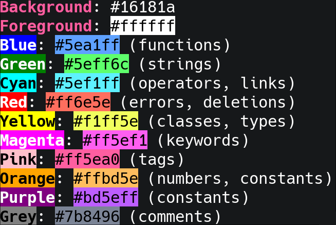

# Cyberdream Theme for bat

A dark theme for [bat](https://github.com/sharkdp/bat) based on the [cyberdream.nvim](https://github.com/scottmckendry/cyberdream.nvim) color palette.

## Color Palette



## Installation

### 1. Locate your bat config directory

```sh
bat --config-dir
```

This typically returns:
- **Linux**: `~/.config/bat`
- **macOS**: `~/.config/bat`
- **Windows**: `%APPDATA%\bat`

### 2. Create the themes directory (if it doesn't exist)

```sh
mkdir -p "$(bat --config-dir)/themes"
```

### 3. Copy the theme file

```sh
cp cyberdream.tmTheme "$(bat --config-dir)/themes/"
```

### 4. Rebuild bat's cache

```sh
bat cache --build
```

### 5. Use the theme

You can use the theme in several ways:

**Temporarily (one-time use):**
```sh
bat --theme=Cyberdream yourfile.txt
```

**Set as default:**
Add this to your bat config file (`$(bat --config-dir)/config`):
```sh
--theme="Cyberdream"
```

Or set it via environment variable in your shell profile (`~/.bashrc`, `~/.zshrc`, `~/.config/fish/config.fish` etc.):
```sh
export BAT_THEME="Cyberdream"
```
```fish
set -Ux BAT_THEME Cyberdream
#or, to set it globally
set -gx BAT_THEME Cyberdream
```

## Verification

To see all available themes including Cyberdream:
```sh
bat --list-themes
```

To preview the theme:
```sh
bat --theme=Cyberdream --list-themes
```

## Screenshots

Try viewing different file types to see the theme in action:
```sh
bat --theme=Cyberdream example.py
bat --theme=Cyberdream example.js
bat --theme=Cyberdream example.md
```

## Credits

- Theme based on [cyberdream.nvim](https://github.com/scottmckendry/cyberdream.nvim) by [scottmckendry](https://github.com/scottmckendry)
- Created for [bat](https://github.com/sharkdp/bat) by [sharkdp](https://github.com/sharkdp)
